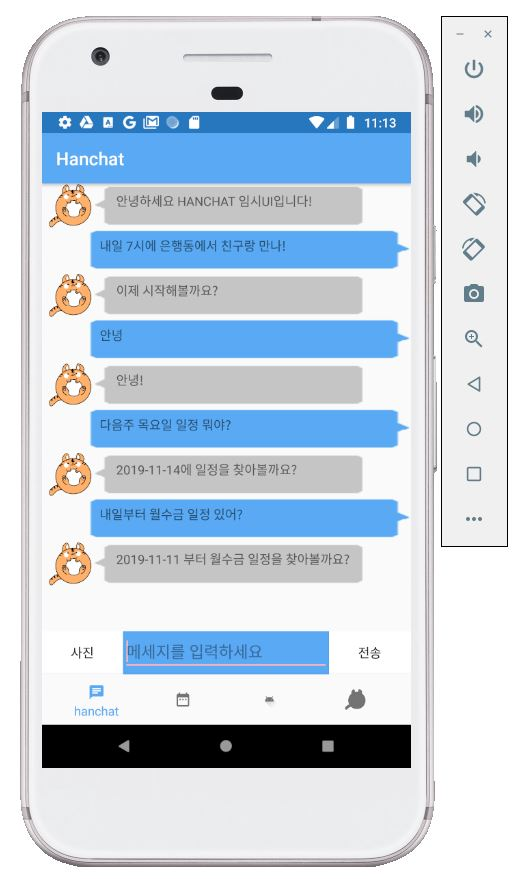
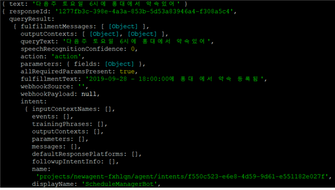
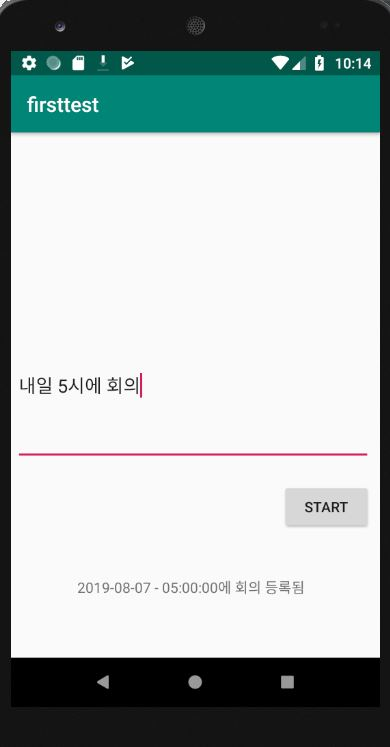

# HanChat
사용자 일정관리 안드로이드 앱 개발 프로젝트

채팅과 같은 **평문에서** 일정 데이터를 추출하여 **일정으로 변환**하고,
최종적으로는 일정이 적힌 **사진에서 글자를 추출**하여 이를 일정으로 변환하는 것이 이 프로젝트의 주요 기능이자 목표이다.
- 사용자는 채팅의 형태로 일정과 관련된 문장을 입력할 수 있다.
- 입력된 문장을 분석하여 사용자의 의도를 파악하고, 해당 의도에 맞는 기능을 수행하는 것을 목표로 한다.
- 사용자가 문장이 적힌 사진을 입력하면 사진에서 문장을 추출하여 채팅한 것과 같은 기능을 수행한다.
- 주요 기능 이외에는 일정 관리의 보조 기능인 캘린더와 그룹 커뮤니티 기능 등이 있다.
-
- java, node.js, postgresql을 사용하고, Dialogflow API, GCP Vision API를 활용하여 구현하였다.
- 서버와 DB는 aws를 활용하였다.
- 한이음 공모전에 제출하여 입선하였다.
- 개발 기간은 약 5개월

3인 팀프로젝트로 안드로이드의 기능 모듈 개발과 서버, 데이터베이스의 설계 및 구현을 하였다.

작동 화면
==================

- 사용자는 위와 같은 화면에서 문장을 입력가능하다.
- 문장이 입력되면 서버로 전송하여 그에 대한 응답에 따라 다시 사용자에게 출력을 하게 된다.

- 서버는 문장을 받으면 해당 문장을 Dialogflow API를 이용해 분석하고, 사용자의 의도를 파악한다.
- 위 사진에서는 사용자가 "다음주 토요일 6시에 홍대에서 약속있어" 라는 문장을 전송받은 서버의 반응이다.
- Dialogflow는 그에 대한 의도를 파악하여 다음주 토요일에 해당하는 2019-09-28 18시에 '홍대' 라는 장소에서 '약속' 이라는 일정을 등록하는 것이 의도라고 파악한다.

프로젝트 종료 시점의 실행 영상은 youtube에 업로드되어 있다.
https://www.youtube.com/watch?v=73255TWkajU

개발 동기 등
=================
팀 프로젝트가 하고 싶었던 와중에 한이음 ICT멘토링에 올라온 프로젝트 아이디어들 둘러보다가 챗봇을 만들어보는 프로젝트를 보고,
여기에 추가 아이디어를 이어붙인 프로젝트.

평소에 화이트보드나 공책등에 쓴 일정을 사진으로 찍어서 바로 일정으로 저장하고 싶다는 아이디어를 그대로 구현해보는 것이 목표였다.
- 목표를 달성하기 위해 필요한 조건들을 확인하다 보니 생각보다 목표가 높았다.

안드로이드, 서버, 데이터베이스 등 모든 것을 처음 해보는 프로젝트였다.
때문에 이 프로젝트에서는 배우는 것이 많았다. 물론 그에 비례해 배우는 시간도 많이 필요했다.

이 프로젝트의 개인적인 목표는 각 기능들을 모듈화하며 진행하는 것이었는데, 이전까지의 프로젝트에서 각 기능들을 독립적으로 구성하는 방식이 장점이 매우 많다고 느꼈기 때문이다.
따라서 내가 구현한 모듈들은 나름 독립성을 가지고 모듈화되어 있고, 필요한 형식은 인터페이스를 활용해 구성하였다.

프로젝트는 모든 기능을 구현하지 못한 채 종료되어 버렸고, 실패한 프로젝트라고 생각하고 있다. 이후 실패 요인을 여러가지로 분석해보았다.
- 팀원 모두가 팀프로젝트가 처음이라 소통에 많은 시간이 필요했다.
- 팀원 모두가 처음 다뤄보는 분야였기에 배우는 시간도 많이 필요했다.
- 목표로 너무 많은 것을 설정했다. 목표에 이것저것을 많이 붙였기에 집중되지 못했다. 목표를 설정할 때에는 하나의 주제로 집중하는 것이 좋아보인다.
- 주제가 집중되지 못한 탓인지 팀원들이 생각하고 있는 주요 기능이 서로 달랐다. 이에 개발 도중에 노선을 바꾸는 일이 많았다. 소통에 더 신경써야 할것으로 보인다.
- 문장을 분석하는 데에 일정한 형식이 없으면 제대로 된 데이터를 추출하기 힘들었다. 또한 이에 사용한 도구인 Dialogflow는 한글을 완벽하게 지원하지 못하는 모습을 보여주었다.

이에 팀프로젝트에서는 먼저 기능 정의를 정확히 하여 모든 개발자가 같은 것을 상상할 수 있어야 한다는 점을 배웠다. 
사실 이 프로젝트에서도 레이아웃을 그리고, 기능을 직접 써가며 소통했기에 기능 정의를 명확히 했다고 생각했지만, 
실제 개발에 들어가니 디테일에서 많이 다르게 생각하고 있는 경우가 많았다.

문제, 해결, 구현
======================
이 프로젝트는 클라이언트, 서버, DB의 구조로, 추가적으로 서버에서 필요한 API를 호출하는 식으로 구현되었다.

서버는 express.js(node.js)를 사용하여 구성하였고, aws ec2 인스턴스에 배치하여 클라이언트와 HTTP 통신을 통해 정보를 주고받도록 하였다.
- 정보는 JSON 객체를 body로 하는 POST요청을 통해 주고받는다.
- 서버의 각 라우터를 구분하여 구현하고, 라우터를 지날때마다 로그를 출력하도록 구현하여 오류를 찾기 쉽게 구현했다.
- 입출력 부분과 동작 부분을 구분하여 기능을 수정하기 쉽다.
- 서버는 Dialogflow API와 GCP Vision API에 대한 연결을 구성하여 사용자가 요청하는 기능에 필요한 API를 호출하여 사용한다.
- 데이터베이스와 연결하여 필요한 sql문을 수행한다.

데이터베이스는 PostgresQL을 사용하여 구성했으며 이 역시 aws에 위치한다.

안드로이드에서는 HTTP 연결을 위한 모듈과 범용적으로 사용가능한 RecyclerView의 Adapter를 개발하였다. 
- 이들은 이후의 안드로이드 프로젝트에서도 계속 개선해가며 사용하고 있다.
- get, post, multipart를 통한 이미지 전송을 구현하여 사용하였다.

이 프로젝트에서 사용된 모든 기술이 처음 활용하는 것이였기에, 대부분의 기술은 적용하기 전에 프로토타입으로 먼저 제작해가며 프로젝트를 진행했다.

- 위 사진은 당시에 개발한 프로토타입 중 하나로, 챗봇 기능을 테스트하는 앱이다.
- 서로 다른 생각을 가지고 있다는 문제점도 프로토타이핑을 통해 어느정도는 보완할 수 있었다.

